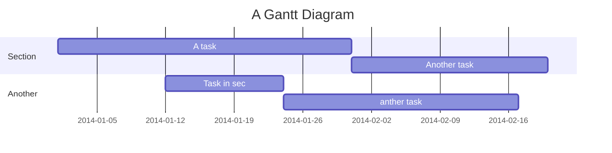

Neural-based Acrostic Generator
===


## Table of Contents

[TOC]

## Beginners Guide

If you are a total beginner to this, start here!

1. Visit hackmd.io
2. Click "Sign in"
3. Choose a way to sign in
4. Start writing note!

User story
---

```gherkin=
Feature: Guess the word

  # The first example has two steps
  Scenario: Maker starts a game
    When the Maker starts a game
    Then the Maker waits for a Breaker to join

  # The second example has three steps
  Scenario: Breaker joins a game
    Given the Maker has started a game with the word "silky"
    When the Breaker joins the Maker's game
    Then the Breaker must guess a word with 5 characters
```
> I choose a lazy person to do a hard job. Because a lazy person will find an easy way to do it. [name=Bill Gates]


```gherkin=
Feature: Shopping Cart
  As a Shopper
  I want to put items in my shopping cart
  Because I want to manage items before I check out

  Scenario: User adds item to cart
    Given I'm a logged-in User
    When I go to the Item page
    And I click "Add item to cart"
    Then the quantity of items in my cart should go up
    And my subtotal should increment
    And the warehouse inventory should decrement
```

> Read more about Gherkin here: https://docs.cucumber.io/gherkin/reference/

User flows
---
```sequence
Alice->Bob: Hello Bob, how are you?
Note right of Bob: Bob thinks
Bob-->Alice: I am good thanks!
Note left of Alice: Alice responds
Alice->Bob: Where have you been?
```

> Read more about sequence-diagrams here: http://bramp.github.io/js-sequence-diagrams/

Project Timeline
---


> Read more about mermaid here: http://knsv.github.io/mermaid/

## Appendix and FAQ

:::info
**Find this document incomplete?** Leave a comment!
:::

## Chinese Examples


## Citation
```
@inproceedings{shen-etal-2019-controlling,
    title = "Controlling Sequence-to-Sequence Models - A Demonstration on Neural-based Acrostic Generator",
    author = "Shen, Liang-Hsin  and
      Tai, Pei-Lun  and
      Wu, Chao-Chung  and
      Lin, Shou-De",
    booktitle = "Proceedings of the 2019 Conference on Empirical Methods in Natural Language Processing and the 9th International Joint Conference on Natural Language Processing (EMNLP-IJCNLP): System Demonstrations",
    month = nov,
    year = "2019",
    address = "Hong Kong, China",
    publisher = "Association for Computational Linguistics",
    url = "https://www.aclweb.org/anthology/D19-3008",
    doi = "10.18653/v1/D19-3008",
    pages = "43--48",
    abstract = "An acrostic is a form of writing that the first token of each line (or other recurring features in the text) forms a meaningful sequence. In this paper we present a generalized acrostic generation system that can hide certain message in a flexible pattern specified by the users. Different from previous works that focus on rule-based solutions, here we adopt a neural- based sequence-to-sequence model to achieve this goal. Besides acrostic, users are also allowed to specify the rhyme and length of the output sequences. Based on our knowledge, this is the first neural-based natural language generation system that demonstrates the capability of performing micro-level control over output sentences.",
}
```

###### tags: `Templates` `Documentation`
